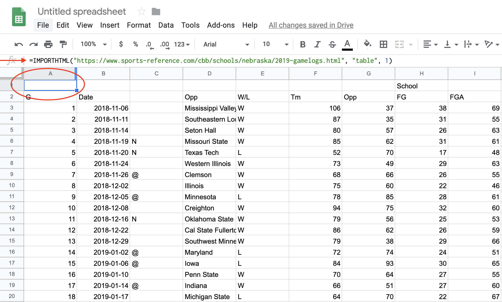
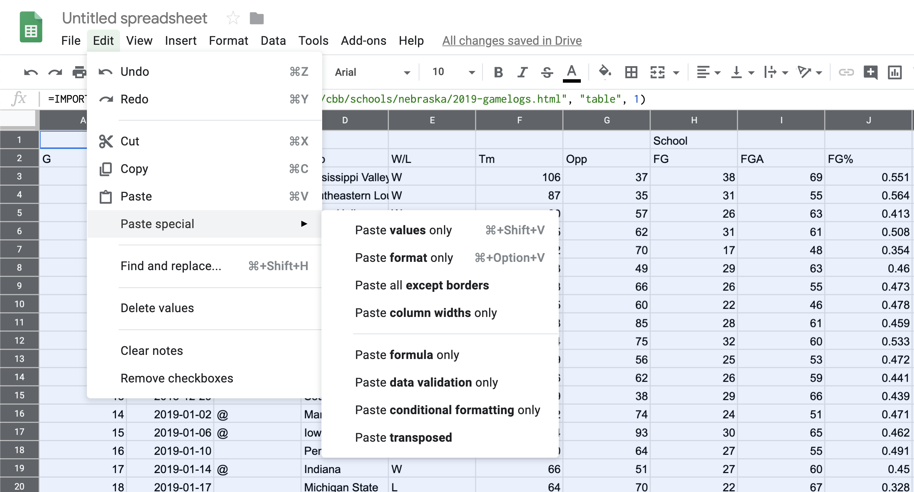
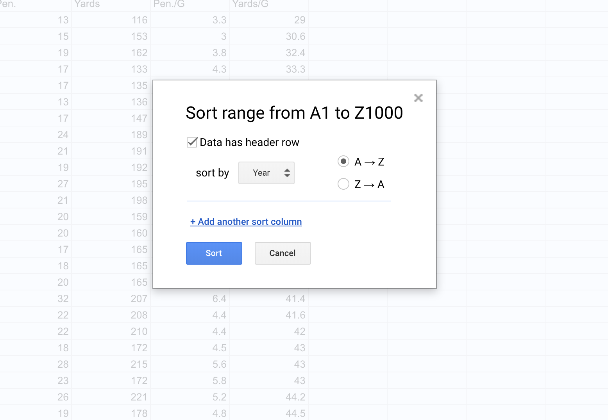

# Data, structures and types

Data are everywhere (and data is plural of datum, thus the use of are in that statement). It surrounds you. Every time you use your phone, you are creating data. Lots of it. Your online life. Any time you buy something. It's everywhere. Sports, like life, is no different. Sports is drowning in data, and more comes along all the time.

In sports, and in this class, we'll be dealing largely with two kinds of data: event level data and summary data. It's not hard to envision event level data in sports. A pitch in baseball. A hit. A play in football. A pass in soccer. They are the events that make up the game. Combine them together -- summarize them -- and you'll have some notion of how the game went. What we usually see is summary data -- who wants to scroll through 50 pitches to find out a player went 2-3 with a double and an RBI? Who wants to scroll through hundreds of pitches to figure out the Rays beat the Yankees? 

To start with, we need to understand the shape of data. 

> EXERCISE: Try scoring a child's board game. For example, Chutes and Ladders. If you were placed in charge of analytics for the World Series of Chutes and Ladders, what is your event level data? What summary data do you keep? If you've got the game, try it. 

## Rows and columns

Data, oversimplifying it a bit, is information organized. Generally speaking, it's organized into rows and columns. Rows, generally, are individual elements. A team. A player. A game. Columns, generally, are components of the data, sometimes called variables. So if each row is a player, the first column might be their name. The second is their position. The third is their batting average. And so on. 


One of the critical components of data analysis, especially for beginners, is having a mental picture of your data. What does each row mean? What does each column in each row signify? How many rows do you have? How many columns? 

## Types

There are scores of data types in the world, and R has them. In this class, we're primarily going to be dealing with data frames, and each element of our data frames will have a data type.

Typically, they'll be one of four types of data:

* Numeric: a number, like the number of touchdown passes in a season or a batting average.
* Character: Text, like a name, a team, a conference.
* Date: Fully formed dates -- 2019-01-01 -- have a special date type. Elements of a date, like a year (ex. 2019) are not technically dates, so they'll appear as numeric data types. 
* Logical: Rare, but every now and then we'll have a data type that's Yes or No, True or False, etc.

**Question:** Is a zip code a number? Is a jersey number a number? Trick question, because the answer is no. Numbers are things we do math on. If the thing you want is not something you're going to do math on -- can you add two phone numbers together? -- then make it a character type. If you don't, most every software system on the planet will drop leading zeros. For example, every zip code in Boston starts with 0. If you record that as a number, your zip code will become a four digit number, which isn't a zip code anymore. 

## A simple way to get data

One good thing about sports is that there's lots of interest in it. And that means there's outlets that put sports data on the internet. Now I'm going to show you a trick to getting it easily. 

The site sports-reference.com takes NCAA (and other league) stats and puts them online. For instance, [here's their page on Nebraska basketball's game logs](https://www.sports-reference.com/cbb/schools/nebraska/2019-gamelogs.html), which you should open now.

Now, in a new tab, log into Google Docs/Drive and open a new spreadsheet. In the first cell of the first row, copy and paste this formula in:

```
=IMPORTHTML("https://www.sports-reference.com/cbb/schools/nebraska/2019-gamelogs.html", "table", 1)
```

If it worked right, you've got the data from that page in a spreadsheet. 

## Cleaning the data

The first thing we need to do is recognize that we don't have data, really. We have the results of a formula. You can tell by putting your cursor on that field, where you'll see the formula again. This is where you'd look:



The solution is easy:

Edit > Select All or type command/control A
Edit > Copy or type command/control c
Edit > Paste Special > Values Only or type command/control shift v

You can verify that it worked by looking in that same row 1 column A, where you'll see the formula is gone.



Now you have data, but your headers are all wrong. You want your headers to be one line -- not two, like they have. And the header names repeat -- first for our team, then for theirs. So you have to change each header name to be UsORB or TeamORB and OpponentORB instead of just ORB.

After you've done that, note we have repeating headers. There's two ways to deal with that -- you could just hightlight it and go up to Edit > Delete Rows XX-XX depending on what rows you highlighted. That's the easy way with our data. 

But what if you had hundreds of repeating headers like that? Deleting them would take a long time. 

You can use sorting to get rid of anything that's not data. So click on Data > Sort Range. You'll want to check the "Data has header row" field. Then hit Sort.



Now all you need to do is search through the data for where your junk data -- extra headers, blanks, etc. -- got sorted and delete it. After you've done that, you can export it for use in R. Go to File > Download as > Comma Separated Values. Remember to put it in the same directory as your R Notebook file so you can import the data easily.
