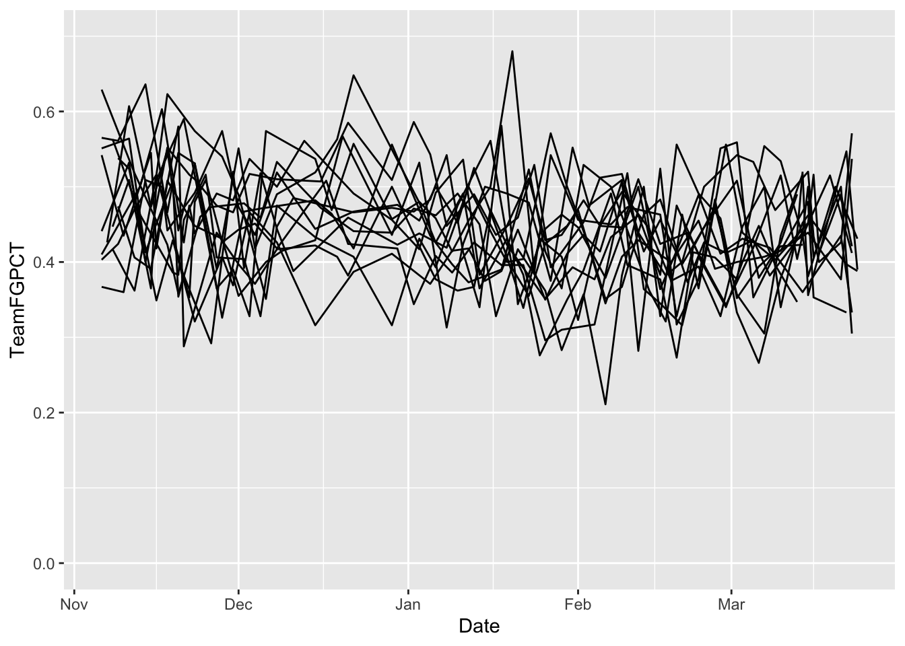

# Facet wraps

Sometimes the easiest way to spot a trend is to chart a bunch of small things side by side. Edward Tufte calls this "small multiples" where ggplot calls this a facet wrap or a facet grid, depending. 

One thing we noticed earlier in the semester -- it seems that a lot of teams shoot worse as the season goes on. Do they? We could answer this a number of ways, but the best way to show people would be visually. Let's use Small Mulitples.

As always, we start with libraries. 


```r
library(tidyverse)
```

```
## ── Attaching packages ────────────────────────────────────────────────────────────── tidyverse 1.2.1 ──
```

```
## ✔ ggplot2 3.2.0     ✔ purrr   0.3.2
## ✔ tibble  2.1.3     ✔ dplyr   0.8.3
## ✔ tidyr   0.8.3     ✔ stringr 1.4.0
## ✔ readr   1.3.1     ✔ forcats 0.4.0
```

```
## Warning: package 'ggplot2' was built under R version 3.5.2
```

```
## Warning: package 'tibble' was built under R version 3.5.2
```

```
## Warning: package 'tidyr' was built under R version 3.5.2
```

```
## Warning: package 'purrr' was built under R version 3.5.2
```

```
## Warning: package 'dplyr' was built under R version 3.5.2
```

```
## Warning: package 'stringr' was built under R version 3.5.2
```

```
## Warning: package 'forcats' was built under R version 3.5.2
```

```
## ── Conflicts ───────────────────────────────────────────────────────────────── tidyverse_conflicts() ──
## ✖ dplyr::filter() masks stats::filter()
## ✖ dplyr::lag()    masks stats::lag()
```

Now data.


```r
logs <- read_csv("data/logs19.csv")
```

```
## Warning: Missing column names filled in: 'X1' [1]
```

```
## Parsed with column specification:
## cols(
##   .default = col_double(),
##   Date = col_date(format = ""),
##   HomeAway = col_character(),
##   Opponent = col_character(),
##   W_L = col_character(),
##   Blank = col_logical(),
##   Team = col_character(),
##   Conference = col_character(),
##   season = col_character()
## )
```

```
## See spec(...) for full column specifications.
```

Let's narrow our pile and look just at the Big Ten.


```r
big10 <- logs %>% filter(Conference == "Big Ten")
```

The first thing we can do is look at a line chart, like we have done in previous chapters. 


```r
ggplot() + geom_line(data=big10, aes(x=Date, y=TeamFGPCT, group=Team)) + scale_y_continuous(limits = c(0, .7))
```



And, not surprisingly, we get a hairball. We could color certain lines, but that would limit us to focus on one team. What if we did all of them at once? We do that with a `facet_wrap`. The only thing we MUST pass into a `facet_wrap` is what thing we're going to separate them out by. In this case, we preceed that field with a tilde, so in our case we want the Team field. It looks like this: 


```r
ggplot() + geom_line(data=big10, aes(x=Date, y=TeamFGPCT, group=Team)) + scale_y_continuous(limits = c(0, .7)) + facet_wrap(~Team)
```


Answer: Not immediately clear, but we can look at this and analyze it. We could add a peice of annotation to help us out. 


```r
big10 %>% summarise(mean(TeamFGPCT))
```

```
## # A tibble: 1 x 1
##   `mean(TeamFGPCT)`
##               <dbl>
## 1             0.442
```


```r
ggplot() + geom_hline(yintercept=.4447, color="dark grey") + geom_line(data=big10, aes(x=Date, y=TeamFGPCT, group=Team)) + scale_y_continuous(limits = c(0, .7)) + facet_wrap(~Team)
```


What do you see here? How do teams compare? How do they change over time? I'm not asking you these questions because they're an assignment -- I'm asking because that's exactly what this chart helps answer. Your brain will immediately start making those connections. 

## Facet grid vs facet wraps

Facet grids allow us to put teams on the same plane, versus just repeating them. And we can specify that plane as vertical or horizontal. For example, here's our chart from above, but using facet_grid to stack them.


```r
ggplot() + geom_hline(yintercept=.4447, color="dark grey") + geom_line(data=big10, aes(x=Date, y=TeamFGPCT, group=Team)) + scale_y_continuous(limits = c(0, .7)) + facet_grid(Team ~ .)
```


And here they are next to each other:


```r
ggplot() + geom_hline(yintercept=.4447, color="dark grey") + geom_line(data=big10, aes(x=Date, y=TeamFGPCT, group=Team)) + scale_y_continuous(limits = c(0, .7)) + facet_grid(. ~ Team)
```


Note: We'd have some work to do with the labeling on this -- we'll get to that -- but you can see where this is valuable comparing a group of things. One warning: Don't go too crazy with this or it loses it's visual power.

## Other types

Line charts aren't the only things we can do. We can do any kind of chart in ggplot. Staying with shooting, where are team's winning and losing performances coming fromwhen we talk about team shooting and opponent shooting? 


```r
ggplot() + geom_point(data=big10, aes(x=TeamFGPCT, y=OpponentFGPCT, color=W_L)) + scale_y_continuous(limits = c(0, .7)) + scale_x_continuous(limits = c(0, .7)) + facet_wrap(~Team)
```


