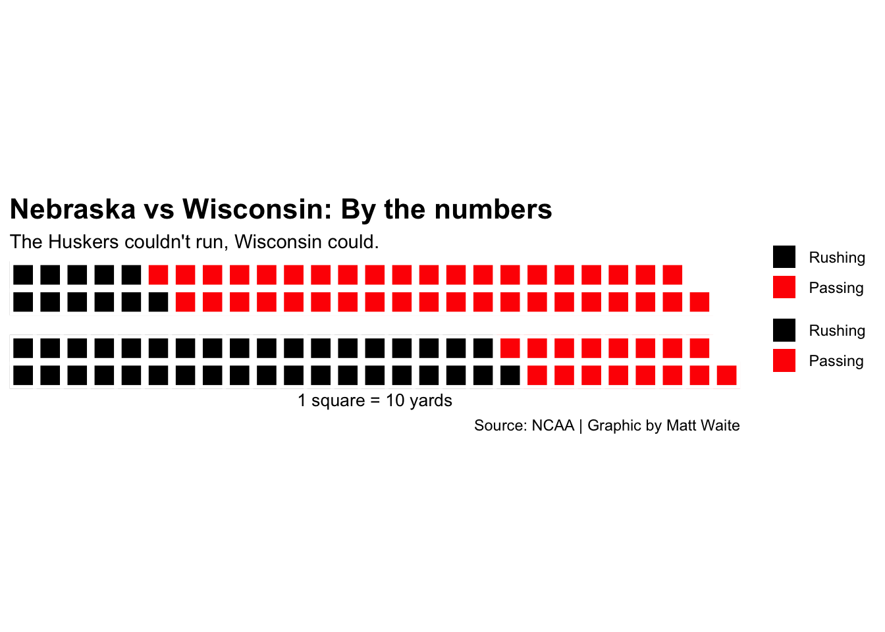

# Finishing Touches 2

Frequently in my classes, students use the waffle charts library quite extensively to make graphics. This is a quick walkthough on how to get a waffle chart into a publication ready state. 


```r
library(waffle)
```

```
## Loading required package: ggplot2
```

```
## Warning: package 'ggplot2' was built under R version 3.5.2
```

Let's look at the offensive numbers from Nebraska v. Wisconsin football game. Nebraska lost 41-24, but Wisconsin gained only 15 yards more than Nebraska did. You can find the [official stats on the NCAA's website](https://www.ncaa.com/game/football/fbs/2018/10/06/nebraska-wisconsin/team-stats).

I'm going to make two vectors for each team and record rushing yards and passing yards. 


```r
nu <- c("Rushing"=111, "Passing"=407, 15)
wi <- c("Rushing"=370, "Passing"=163, 0)
```

So what does the breakdown of Nebraska's night look like? How balanced was the offense? 

The waffle library can break this down in a way that's easier on the eyes than a pie chart. We call the library, add the data, specify the number of rows, give it a title and an x value label, and to clean up a quirk of the library, we've got to specify colors. 

**ADDITIONALLY**

We can add labels and themes, but you have to be careful. The waffle library is applying it's own theme, but if we override something they are using in their theme, some things that are hidden come back and make it worse. So here is an example of how to use ggplot's `labs` and the theme to make a fully publication ready graphic. 


```r
waffle(nu/10, rows = 5, xlab="1 square = 10 yards", colors = c("black", "red", "white")) + labs(title="Nebraska vs Wisconsin on offense", subtitle="The Huskers couldn't get much of a running game going.", caption="Source: NCAA | Graphic by Matt Waite") + 
  theme(
    plot.title = element_text(size = 16, face = "bold"),
    axis.title = element_text(size = 10),
    axis.title.y = element_blank()
  )
```


Note: The alignment of text sucks. 

How to fix that? We can use ggsave to a pdf and fix it in Illustrator.


```r
waffle(nu/10, rows = 5, xlab="1 square = 10 yards", colors = c("black", "red")) + labs(title="Nebraska vs Wisconsin on offense", subtitle="The Huskers couldn't get much of a running game going.", caption="Source: NCAA | Graphic by Matt Waite") + 
  theme(
    plot.title = element_text(size = 16, face = "bold"),
    axis.title = element_text(size = 10),
    axis.title.y = element_blank()
  ) + ggsave("waffle.pdf")
```

But what if we're using a waffle iron? And what if we want to change the output size? It gets tougher. 

Truth is, I'm not sure what is going on with the sizing. You can try it and you'll find that the outputs are ... unpredictable. 

Things you need to know about waffle irons:

* They're a convenience method, but all they're really doing is executing two waffle charts together. If you don't apply the theme to both waffle charts, it breaks.
* You will have to get creative about applying headline and subtitle to the top waffle chart and the caption to the bottom. 
* Using ggsave doesn't work either. So you'll have to use R's pdf output. 

Here is a full example. I start with my waffle iron code, but note that each waffle is pretty much a self contained thing. That's because a waffle iron isn't really a thing. It's just a way to group waffles together, so you have to make each waffle individually. My first waffle has the title and subtitle but no x axis labels and the bottom one has not title or subtitle but the axis labels and the caption.  


```r
iron(
 waffle(
   nu/10, 
   rows = 2, 
   colors = c("black", "red", "white")) + 
   labs(title="Nebraska vs Wisconsin: By the numbers", subtitle="The Huskers couldn't run, Wisconsin could.") + 
   theme(
    plot.title = element_text(size = 16, face = "bold"),
    axis.title = element_text(size = 10),
    axis.title.y = element_blank()
  ),
 waffle(
   wi/10, 
   rows = 2, 
   xlab="1 square = 10 yards", 
   colors = c("black", "red", "white")) + labs(caption="Source: NCAA | Graphic by Matt Waite")
) 
```



If you try to use ggsave on that, you'll only get the last waffle chart. Like I said, irons aren't really anything, so ggplot ignores them. So to do this, we have to use R's pdf capability. 

Here's the same code, but wrapped in the R pdf functions. The first line says we're going to output this as a pdf with this name. Then my code, then `dev.off` to tell R that's what I want as a PDF. Don't forget that. 


```r
pdf("waffleiron.pdf")
iron(
 waffle(
   nu/10, 
   rows = 2, 
   colors = c("black", "red", "white")) + 
   labs(title="Nebraska vs Wisconsin: By the numbers", subtitle="The Huskers couldn't run, Wisconsin could.") + 
   theme(
    plot.title = element_text(size = 16, face = "bold"),
    axis.title = element_text(size = 10),
    axis.title.y = element_blank()
  ),
 waffle(
   wi/10, 
   rows = 2, 
   xlab="1 square = 10 yards", 
   colors = c("black", "red", "white")) + labs(caption="Source: NCAA | Graphic by Matt Waite")
) 
dev.off()
```


It probably still needs work in Illustrator, but less than before. 

